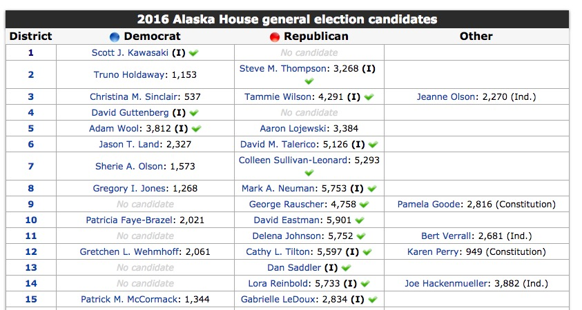
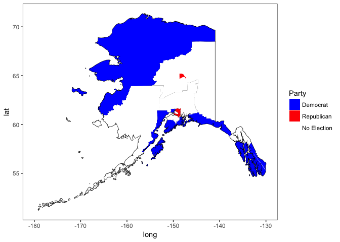

### Requirements

To use these scripts, you will need [R](http://r-project.org) installed.
I also recomment using [R Studio](http://rstudio.org) to run it. Once
you install R, you'll also need a few packages. For baseline data entry,
in R, run

    install.packages("tidyverse")
    install.packages("readxl")
    install.packages("stringr")

If you want to use the map maping scripts:

    install.packages("sp")
    install.packages("rgdal")
    install.packages("ggplot2")
    install.packages("leaflet")
    install.packages("forcats")

### Getting Data from Ballotpedia into the State Leg Format

To get data in,

1.  Find the appropriate elections data tables from Ballotpedia from
    pages such as
    <https://ballotpedia.org/Alaska_House_of_Representatives_elections,_2016> -
    it will look like

1.  Copy this table and paste it into excel. Make sure the top line of
    the spreadsheet is "District, Democrat, Republican, Other". Save
    into the folder `raw_data` as an excel file (not a CSV!) and
    closeit .

2.  Once you have all of the tables you want,
    open R/01\_make\_clean\_votes.R. Make sure your working directory is
    set to the directory that file is in. E.g., in Rstudio, go to the
    Session Menu, then select Set Working Director &gt; To Source
    File Location.

3.  Run the file. It will scroll through all of the files in the
    raw\_data folder and spit out nicely formatted data into the
    clean\_data folder.

That's it!

### Making Maps

This is still in progress, but, you can visit
<https://www.census.gov/geo/maps-data/data/cbf/cbf_sld.html> to get
shapefiles of the 2015 state upper and lower legislative districts.
Unzip the relevant shapefile into the `spatial_data` folder. I've
provided Alaska as an example.

You then can open `mapping_functions.R` run it, and then you're free to
make maps. For example, for the Alaska State House

    ak_upper_combined <- make_district_data(shapefile = "cb_2015_02_sldu_500k",
                                             layer_name = "cb_2015_02_sldu_500k",
                                             votefile = "alaska_senate_2016.csv",
                                             spatial_dir = "./spatial_data/",
                                             vote_dir = "./clean_data/")

    ## OGR data source with driver: ESRI Shapefile 
    ## Source: "./spatial_data/cb_2015_02_sldu_500k", layer: "cb_2015_02_sldu_500k"
    ## with 20 features
    ## It has 9 fields

    ## Regions defined for each Polygons

    ## Joining, by = "id"

    ## Joining, by = "District"

    ## Warning: Unknown levels in `f`: Independent

This creates a dataset of district borders and information about each.
I'll work up something for the `sp` library in the future so we can use
`leaflet`. The data columns contained for plotting are

    names(ak_upper_combined)

    ##  [1] "long"       "lat"        "order"      "hole"       "piece"     
    ##  [6] "group"      "id"         "STATEFP"    "SLDUST"     "AFFGEOID"  
    ## [11] "GEOID"      "District"   "LSAD"       "LSY"        "ALAND"     
    ## [16] "AWATER"     "State"      "Body"       "Year"       "Term"      
    ## [21] "Party"      "Prvote"     "Propvote"   "PrMargin"   "ThreePVote"

Note that for districts where there was no election that year, there are
NAs for many values. `make_district_data` will put "No Election" in the
`Party` column for these districts.

After this, you can make some nice maps, such as the party winners

    #Make a nice map using ggplot2
    ggplot(ak_upper_combined, mapping=aes(x=long, y=lat, group=group, fill=Party)) +
      geom_path() +
       geom_polygon() +
       xlim(c(-180, -130)) +
       theme_bw() +
       theme(panel.grid = element_blank()) +
       scale_fill_manual(values = c("Blue", "Red", "White"))

Or others (Happy to take suggestions here!)
